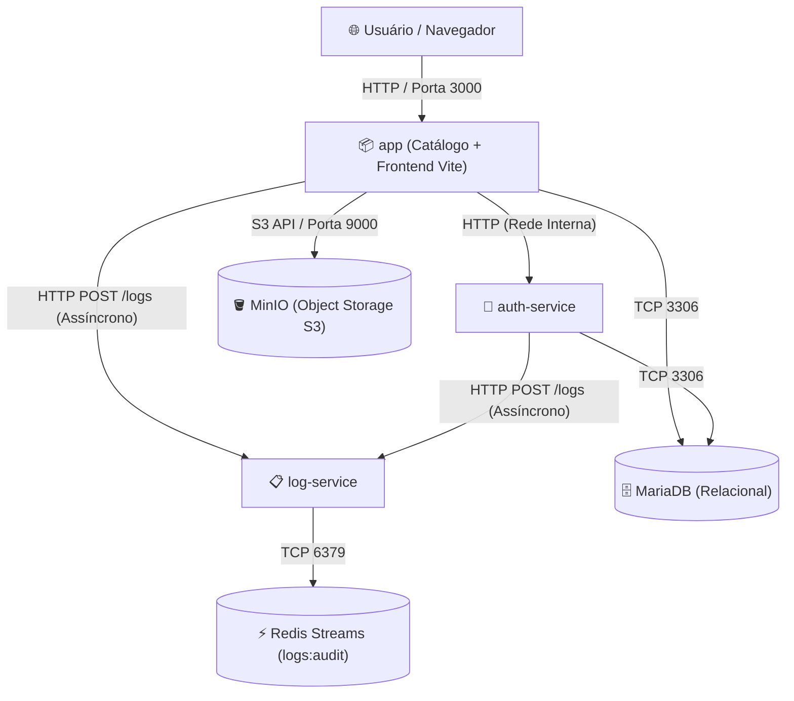

# 🎬 Catálogo de Filmes — Tom Hanks (Atividade 5 · Microserviço de Auditoria com Redis Streams)

Aplicação web de alta disponibilidade para exploração da filmografia de **Tom Hanks**, com integração ao vivo da API externa do **TMDB (The Movie Database)**, controle de permissões por papel (**RBAC**), persistência relacional no **MariaDB** e **Microserviço Dedicado de Auditoria e Logs** alimentado por **Redis Streams**.

> 🎓 Projeto desenvolvido para a disciplina de **Computação em Nuvem / Infraestrutura** lecionada pelo professor **[@siriani](https://github.com/siriani)**.

---

## 🏗️ Arquitetura de Microsserviços Desacoplados

O ambiente é orquestrado via **Docker Compose** com isolamento estrito de responsabilidades e rede interna privada:



| Serviço | Contêiner | Porta Host | Função |
| :--- | :--- | :---: | :--- |
| **`app`** | `tomhanks_app` | `3000:3000` | Gateway do Catálogo, Frontend React (Vite) e BFF da aplicação |
| **`auth-service`** | `tomhanks_auth` | *Privada* | Registro, autenticação JWT, confirmação de conta via OTP Brevo e RBAC |
| **`log-service`** | `tomhanks_log` | *Privada* | **Microserviço de Auditoria**: Ingestão e consulta de logs |
| **`redis`** | `tomhanks_redis` | *Privada* | Armazenamento chave-valor de altíssima vazão com **Redis Streams** (`logs:audit`) |
| **`minio`** | `tomhanks_minio` | `9010:9000` / `9011:9001` | **Object Storage S3-compatível**: Armazenamento seguro de fotos de perfil |
| **`mariadb`** | `tomhanks_mariadb` | `127.0.0.1:3307` | Banco relacional para usuários, listas, filmes favoritos e comentários |

---

## ⚡ Por que Redis Streams e NÃO o Banco Relacional (MariaDB)?

Na arquitetura de sistemas distribuídos e computação em nuvem, **logs de auditoria** e **dados transacionais de negócio** possuem perfis de acesso diametralmente opostos:

1. **Padrão de Acesso (Write-Heavy vs. Read-Heavy):**
   - Logs de auditoria são gerados em praticamente qualquer interação do usuário (altíssima taxa de escrita contínua e append-only).
   - Consultas de auditoria ocorrem esporadicamente, quase que exclusivamente por administradores ou pipelines de segurança.
   - Escrever logs no MariaDB sobrecarregaria o banco relacional com locks de escrita, fragmentação de índices e crescimento acelerado de tabelas de transação.

2. **Ausência de Necessidade de Transações Complexas (ACID):**
   - Logs não realizam operações `JOIN`, não possuem chaves estrangeiras dinâmicas e não participam de transações distribuídas (Two-Phase Commit).
   - Um erro no envio de log **não deve** travar ou abortar a ação legítima do usuário no catálogo.

3. **Vantagens do Redis Streams (`XADD` e `XREVRANGE`):**
   - **Performance em Memória:** Operações de append com latência sub-milissegundo (`O(1)` amortizado).
   - **Ordenação Temporal Nativa:** Os IDs gerados pelo Redis (`<millisecondsTime>-<sequenceNumber>`) são estritamente ordenados no tempo.
   - **Zero Alteração no MariaDB:** O schema relacional permaneceu 100% intacto.

---

## 🔍 Comandos Redis Streams Utilizados no `log-service`

O microserviço `log-service` interage com o Redis utilizando a chave de stream `logs:audit`:

### 1. Ingestão de Log: `XADD`
Para cada evento capturado pelo catálogo ou serviço de autenticação, o microserviço executa:
```redis
XADD logs:audit * usuario_id "1" acao "FAVORITAR_FILME" timestamp "2026-09-08T10:30:00.000Z" ip "172.20.0.1" detalhes "{\"tmdb_movie_id\":13,\"titulo\":\"Forrest Gump\"}"
```
- `*` instrui o Redis a gerar automaticamente um ID baseado em milissegundos UTC.

### 2. Consulta de Auditoria: `XREVRANGE`
Para que os administradores visualizem os eventos ordenados do mais recente para o mais antigo:
```redis
XREVRANGE logs:audit + - COUNT 100
```
- `+`: Representa o ID mais recente existente no stream.
- `-`: Representa o ID mais antigo.
- `COUNT 100`: Retorna a janela mais recente de 100 eventos para renderização veloz na interface.

---

## 📋 Eventos Auditados e Estrutura dos Dados

Todos os eventos contêm os campos obrigatórios: `usuario_id`, `acao`, `timestamp`, `ip` e o campo opcional enriquecido `detalhes`.

| Evento (`acao`) | Origem | Descrição / Detalhes |
| :--- | :--- | :--- |
| `LOGIN_SUCESSO` | `auth-service` / `backend` | Login autenticado com sucesso e emissão de token JWT |
| `LOGIN_FALHA` | `auth-service` / `backend` | Tentativa com credenciais inválidas ou conta inexistente |
| `LOGOUT` | `backend` | Encerramento de sessão e descarte de credenciais |
| `FAVORITAR_FILME` | `backend` | Filme adicionado aos favoritos (`tmdb_movie_id`, `titulo`) |
| `DESFAVORITAR_FILME` | `backend` | Remoção de filme dos favoritos |
| `CRIAR_COMENTARIO` | `backend` | Postagem de resenha da comunidade (`tmdb_movie_id`, trecho) |
| `DELETAR_COMENTARIO_PROPRIO` | `backend` | Usuário apagou seu próprio comentário |
| `MODERAR_COMENTARIO_ADMIN` | `backend` | **Ação Admin**: Moderação e exclusão de comentário de terceiros |
| `ALTERAR_PAPEL_USUARIO` | `auth-service` | **Ação Admin**: Promoção ou rebaixamento de papel de usuário |
| `EXCLUIR_USUARIO` | `auth-service` | **Ação Admin**: Exclusão definitiva de conta de usuário |
| `🚨 BLOQUEIO_RBAC_403` | `backend` | **403 Forbidden**: Papel insuficiente para acessar endpoint sensível |
| `🚨 BLOQUEIO_RBAC_ADMIN_403`| `backend` / `auth-service` | **403 Forbidden**: Não-administrador tentando acessar rota de admin |
| `🚨 BLOQUEIO_LIMITE_FAVORITOS_403` | `backend` | **403 Forbidden**: Usuário Comum tentando passar de 5 favoritos |
| `🚨 BLOQUEIO_EMAIL_NAO_VERIFICADO_403` | `backend` / `auth-service`| **403 Forbidden**: Tentativa de acesso com conta pendente de OTP |

---

## 🛡️ Consulta de Auditoria e Proteção RBAC

A consulta de logs é restrita **exclusivamente aos administradores** via endpoint e interface web:

- **Endpoint de Consulta:** `GET /api/admin/logs` (e alias `GET /api/auth/logs`)
- **Middlewares Aplicados:** `authMiddleware` + `requireAdmin`
- **Comportamento de Segurança:**
  - Se um usuário comum ou VIP (`premium`) tentar requisitar o endpoint, o backend responde imediatamente com **HTTP 403 Forbidden** e **registra no próprio Redis a tentativa de violação**:
    ```json
    {
      "error": "Acesso permitido apenas para administradores."
    }
    ```
  - Se um administrador autenticado requisitar, recebe os logs ordenados:
    ```json
    {
      "total": 50,
      "stream": "logs:audit",
      "logs": [
        {
          "id": "1725798234567-0",
          "usuario_id": "1",
          "acao": "BLOQUEIO_RBAC_ADMIN_403",
          "timestamp": "2026-09-08T10:35:12.000Z",
          "ip": "172.20.0.1",
          "detalhes": { "rota": "/api/admin/logs", "motivo": "Acesso não autorizado" }
        }
      ]
    }
    ```

---

## 💻 Visualização no Frontend (AdminDashboard)

No painel administrativo (`AdminDashboard.jsx`), a aba **"Auditoria (Redis Streams)"** apresenta:
1. **Indicador de Conexão com o Stream:** Sinalizador `REDIS STREAM: logs:audit` com animação de pulso.
2. **Filtros Rápidos por Categoria:** `Todos`, `🚨 403 Forbidden`, `🔑 Logins`, `⭐ Favoritos`, `💬 Comentários`, `🛡️ Moderação`.
3. **Badges Estilizadas:** Cores exclusivas para bloqueios 403 (vermelho carmesim), logins válidos (verde esmeralda), moderação (roxo) e favoritos (âmbar).
4. **Sincronização em Tempo Real:** Botão **"Atualizar Logs"** com consulta imediata ao Redis via `XREVRANGE`.

---

## 🧪 Roteiro de Demonstração e Verificação

### 1. Iniciar os Contêineres
```bash
docker compose up -d --build
```

### 2. Inspecionar Diretamente o Redis Streams via CLI
Para inspecionar os eventos crus armazenados no Redis:
```bash
docker exec -it tomhanks_redis redis-cli XREVRANGE logs:audit + - COUNT 10
```

Para verificar o tamanho do stream e estatísticas da chave:
```bash
docker exec -it tomhanks_redis redis-cli XLEN logs:audit
```

### 3. Testar Registro de Bloqueio 403 (Tentativa Não Autorizada)
1. Faça login com um usuário comum e obtenha seu token.
2. Tente acessar o endpoint de logs:
```bash
curl -i -X GET http://localhost:3000/api/admin/logs \
  -H "Authorization: Bearer <TOKEN_USUARIO_COMUM>"
```
> **Retorno:** `HTTP/1.1 403 Forbidden`.
3. Consulte o Redis novamente: você verá o evento `BLOQUEIO_RBAC_ADMIN_403` gravado no stream em tempo real.

### 4. Consultar Logs como Administrador
```bash
curl -X GET http://localhost:3000/api/admin/logs \
  -H "Authorization: Bearer <TOKEN_ADMIN>"
```
> **Retorno:** `HTTP/1.1 200 OK` com a lista JSON dos eventos auditados.

---

## 🪣 Armazenamento de Fotos de Perfil com MinIO (Object Storage S3)

### Por que usar MinIO (Object Storage) em vez de gravar imagens no MariaDB (BLOB)?
1. **Evita Inchaço do Banco Relacional:** Salvar arquivos binários (`BLOB`) no MariaDB causaria fragmentação do InnoDB Buffer Pool, backups gigantescos e lentidão em operações de `SELECT` ou `JOIN`.
2. **Escalabilidade Horizontal:** O MinIO opera sob a API S3, permitindo migração direta para AWS S3, Cloudflare R2 ou Google Cloud Storage sem alterar uma única linha de regra de negócio.
3. **Desacoplamento:** O MariaDB armazena apenas a referência (`avatar_url`), enquanto os arquivos binários são servidos pelo gateway de streaming da aplicação (`/api/profile/avatar/:filename`).

---

## 🛡️ Proteção Anti-IDOR (Insecure Direct Object Reference)

Para evitar que um usuário mal-intencionado edite o perfil de outro modificando o ID na URL ou no corpo da requisição:
- O backend extrai a identidade real diretamente do **Token JWT assinado** (`req.usuarioId`).
- Se o usuário tentar enviar `PUT /api/profile/:id` ou `{ usuario_id: outro_id }`, o sistema detecta a divergência e rejeita imediatamente com **`HTTP 403 Forbidden`**:

```json
{
  "error": "Acesso negado: você não tem autorização para editar o perfil de outro usuário (Proteção Anti-IDOR)."
}
```
Além disso, a tentativa de ataque é registrada automaticamente no **Redis Streams** (`BLOQUEIO_IDOR_403`).

### Como Demonstrar a Tentativa Recusada (Anti-IDOR):
Execute no terminal ou no DevTools Console (estando logado com o usuário ID 1 e tentando alterar o perfil do usuário 99):
```bash
curl -i -X PUT http://localhost:3000/api/profile/99 \
  -H "Authorization: Bearer <SEU_TOKEN_JWT>" \
  -H "Content-Type: application/json" \
  -d '{"nome": "Tentativa Hacker"}'
```
> **Resultado:** `HTTP/1.1 403 Forbidden` com código `IDOR_BLOCK`.

---

## 👤 Autor e Créditos
- **Disciplina:** Computação em Nuvem / Infraestrutura
- **Professor:** **[@siriani](https://github.com/siriani)**
- **API Externa de Filmes:** [The Movie Database (TMDB)](https://www.themoviedb.org/)
